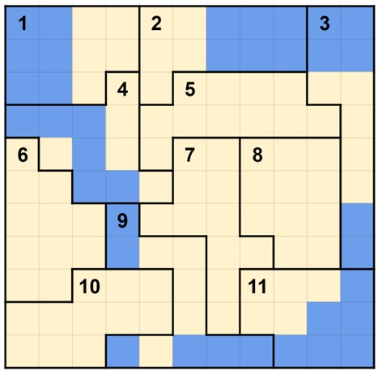
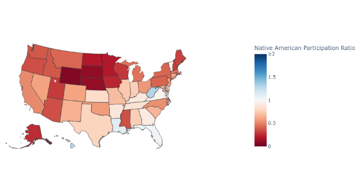
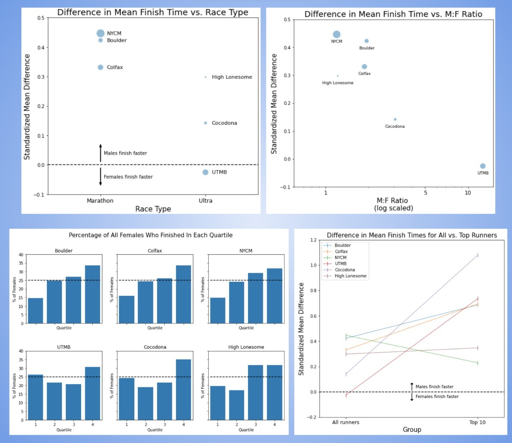

# Portfolio

---

## Curriculum Development

  * [Gerrymandering (9th grade math, literacy, civics)](https://drive.google.com/drive/folders/1sv2A-RY43OXeIYjdW51A7RfEFDGX-xAi?usp=sharing)

Selected student-facing materials from a seven week project.

---
  * [Egyptian Fractions (5th grade math)](https://drive.google.com/drive/folders/1D2_mVI2BtmnV_lVx0j5Kw97r9slnq0WP?usp=sharing)

All materials for a three day project.

---
More Things!
  * [2nd place submission](https://www.datascience4everyone.org/post/data-science-for-everyone-ds4e-announces-bite-sized-lesson-plan-competition-winners) to a data science lesson plan competition (lesson materials linked on webpage)
  * Desmos activities for [3rd grade](https://teacher.desmos.com/activitybuilder/custom/63233179fed9ac064088948e) (fraction sense) and [algebra](https://teacher.desmos.com/activitybuilder/custom/632ba593372919ceb27c2d2f) (linear, quadratic, and exponential functions)

---
---

## Data Science & Math

  * [Advanced Placement Test Participation Dashboard](https://github.com/ianmcmeek/AP-Test-Participation-Dashboard/blob/main/Supplemental/Analysis.md)

---
  * [Gender Trends in Long Distance Running Performance](https://github.com/ianmcmeek/Running-Performance-Trends/blob/main/README.md)

  
---
More Things!
  * Co-authored [graph theory research paper](https://arxiv.org/abs/1808.05835)

---
---

Page template forked from <a href="https://github.com/evanca/quick-portfolio">evanca</a>

<!-- Remove above link if you don't want to attibute -->
