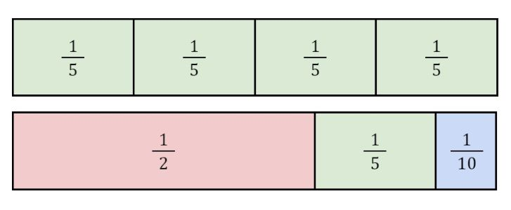

## Portfolio

---

### Curriculum

[Gerrymandering (9th grade math, civics)](/sample_page)
<<<<<<< Updated upstream
=======
<<<<<<< HEAD
<<<<<<< HEAD

---
[Egyptian Fractions (5th grade math)](/pdf/sample_presentation.pdf)

=======
>>>>>>> Stashed changes

---
[Egyptian Fractions (5th grade math)](/pdf/sample_presentation.pdf)

<<<<<<< Updated upstream
=======
>>>>>>> 977f02e29ca05fc4d0358cb74a9bd6907e1d163c
=======

---
[Egyptian Fractions (5th grade math)](/pdf/sample_presentation.pdf)

>>>>>>> 977f02e29ca05fc4d0358cb74a9bd6907e1d163c
>>>>>>> Stashed changes

---

### Data Science & Math

<<<<<<< HEAD
  * [Advanced Placement Test Participation Dashboard](https://github.com/ianmcmeek/AP-Test-Participation-Dashboard/blob/main/Supplemental/Analysis.md)

  * [Gender Trends in Long Distance Running Performance](http://example.com/)
  * [Graph Theory Research Paper](http://example.com/)
=======
- [Advanced Placement Test Participation Dashboard](https://github.com/ianmcmeek/AP-Test-Participation-Dashboard/blob/main/Supplemental/Analysis.md)

- [Gender Trends in Long Distance Running Performance](http://example.com/)
- [Graph Theory Research Paper](http://example.com/)
>>>>>>> 977f02e29ca05fc4d0358cb74a9bd6907e1d163c

---

---

Page template forked from <a href="https://github.com/evanca/quick-portfolio">evanca</a>

<!-- Remove above link if you don't want to attibute -->
